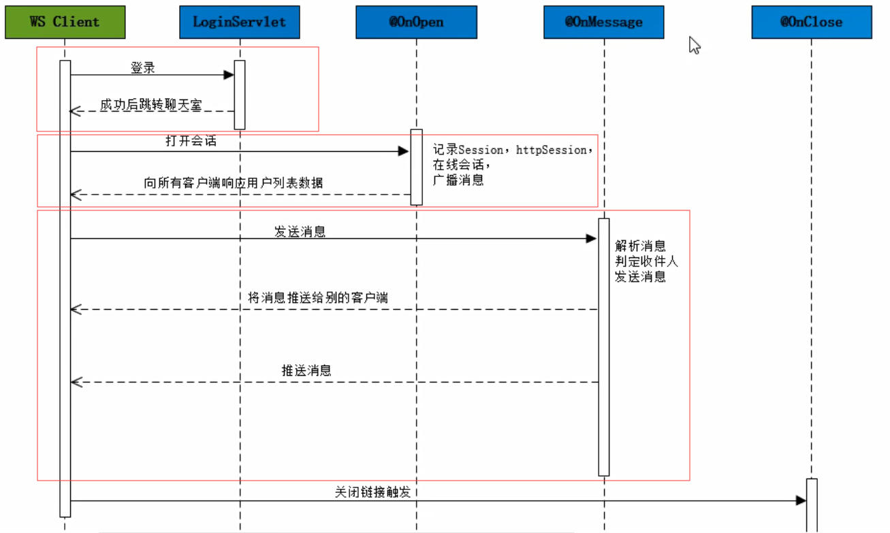
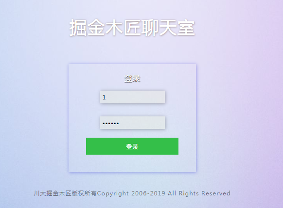
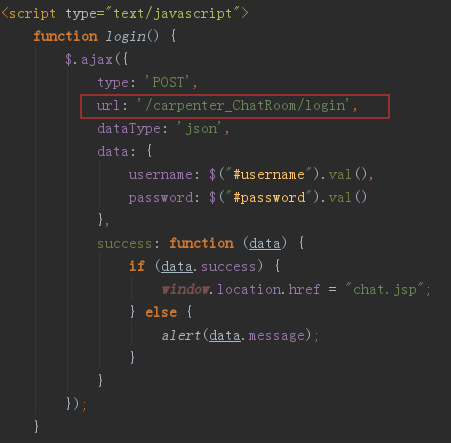
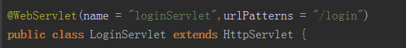
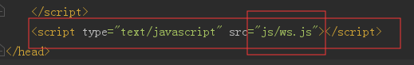
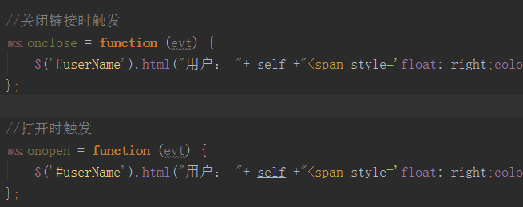
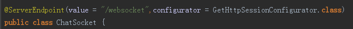
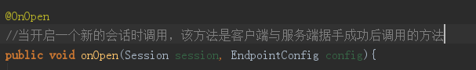

* 默认登录http://localhost:8080/carpenter_ChatRoom/login.jsp

  

## 第一阶段

* login.jsp发送Ajax请求，请求LoginServlet

  

* 登录判断，如果成功从login.jsp转到chat.jsp

  

* chat.jsp中包含了js脚本

  

## 第二阶段

* chat.jsp的body 加载完毕后触发一个ws.js文件中的方法 startWebSocket

  

  

  * 链接开启/关闭过程中会触发

  

* 向以上地址发送WebSocket请求，WebSocket服务

  

* 触发OnOpen方法

## 第三阶段

* 

